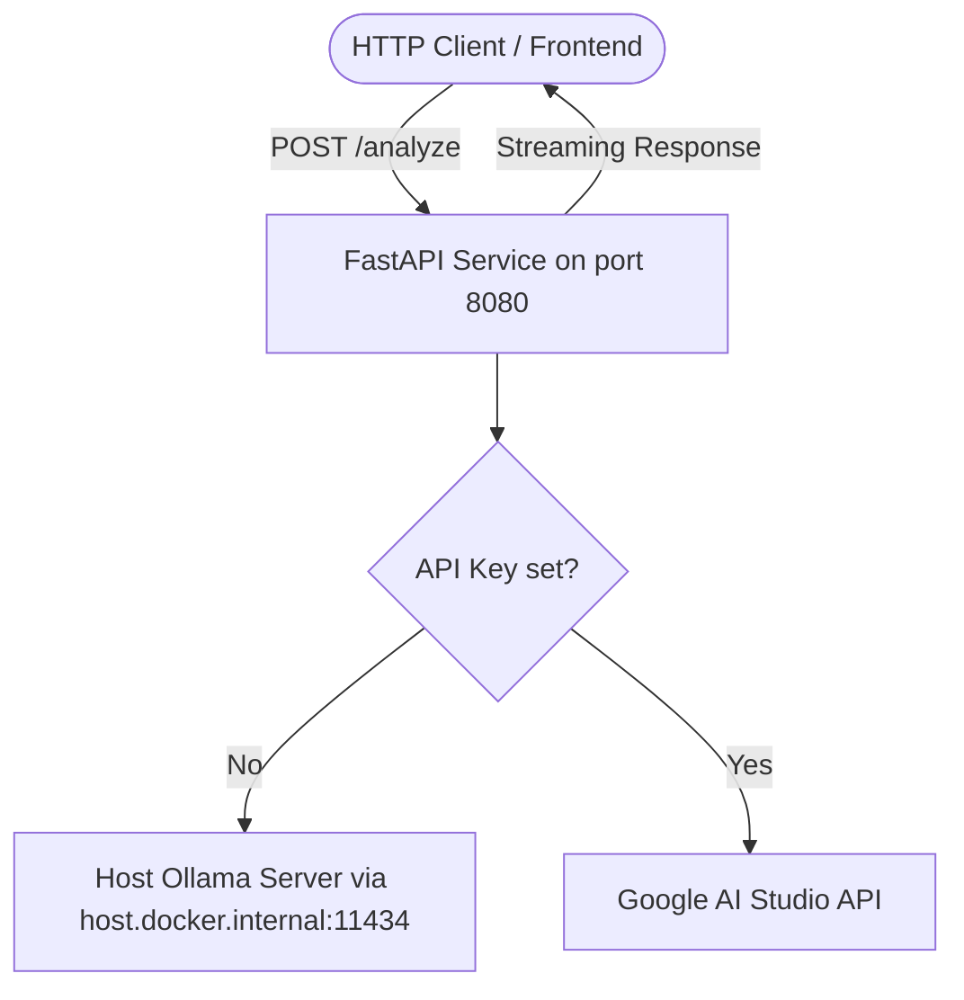

# Live Demo Guide: Gemma 4 World Cup Analyst (Production FastAPI & Docker)

This guide explains the architecture and setup of the `world_cup_analyst.py` demo and its production-grade FastAPI microservice counterpart.

---

## 1. System Architecture

The project supports both a **CLI utility** (`world_cup_analyst.py`) and a **production FastAPI microservice** (`app.py`), both capable of calling Google Cloud (Gemini API) or local fallback (Ollama API).



---

## 2. Docker & Container Deployment

To make the service deployable to production platforms like **Google Cloud Run** or run containerized locally, we have included a `Dockerfile` and `docker-compose.yml`.

### Build & Deploy to Google Cloud Run
You can build the container image and deploy it serverless to Cloud Run (configured on port `8080`):
```bash
# Build the container locally
docker build -t gemma4-worldcup-api .

# Run the container locally
docker run -p 8080:8080 -e GEMINI_API_KEY="your-api-key" gemma4-worldcup-api
```

### Run Local Compose Stack (API linked to Host Ollama)
To run the web service containerized and connect it to your Mac host's Ollama server (which already has the model weights downloaded):
1. Start the Compose stack:
   ```bash
   docker-compose up --build
   ```
   *(This starts the FastAPI service on `http://localhost:8080` and maps it to your host's Ollama instance at `http://host.docker.internal:11434`.)*
2. Send a test request in another terminal:
   ```bash
   curl -X POST http://localhost:8080/analyze \
     -H "Content-Type: application/json" \
     -d '{"scenario": "90th min penalty shootout, USA vs Canada, Pulisic vs Crepeau", "local": true}'
   ```

---

## 3. API Endpoints

### 1. POST `/analyze`
Returns the final structured JSON commentary and tactical analysis.
*   **Request Body:**
    ```json
    {
      "scenario": "90th min penalty, USA vs Canada, Pulisic vs Crépeau",
      "local": false
    }
    ```
*   **Response:**
    ```json
    {
      "commentator_script": "...",
      "tactical_breakdown": "...",
      "excitement_index": 9
    }
    ```

### 2. POST `/analyze/stream`
Streams the model's reasoning thoughts live (SSE event stream) followed by the final JSON block.
